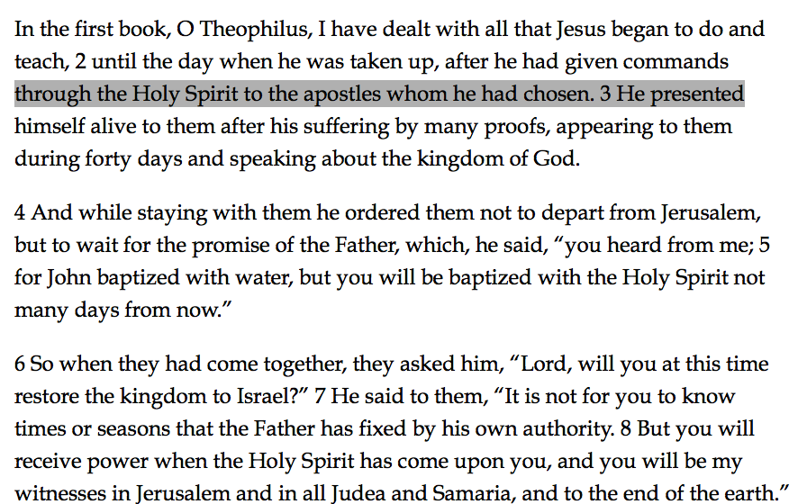
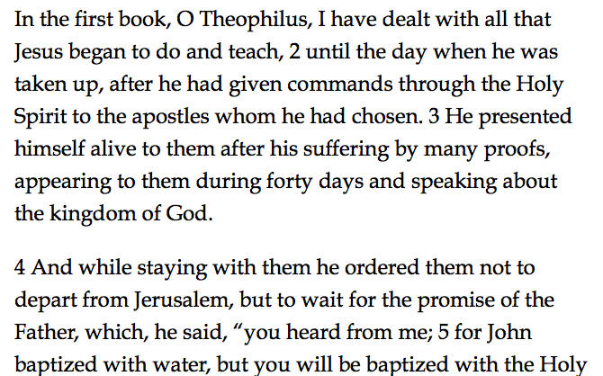
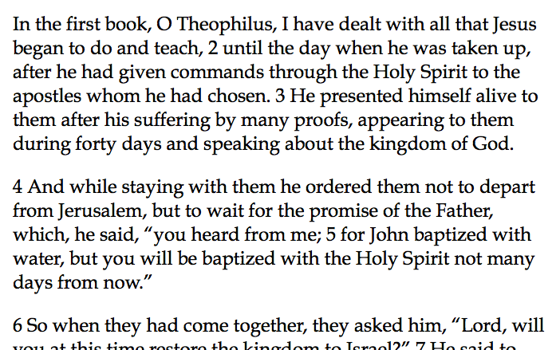
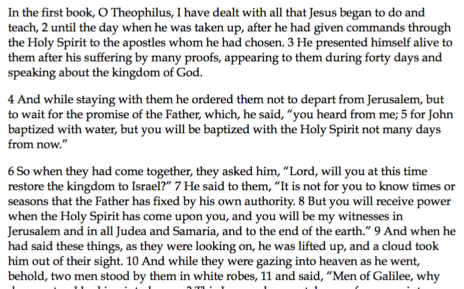
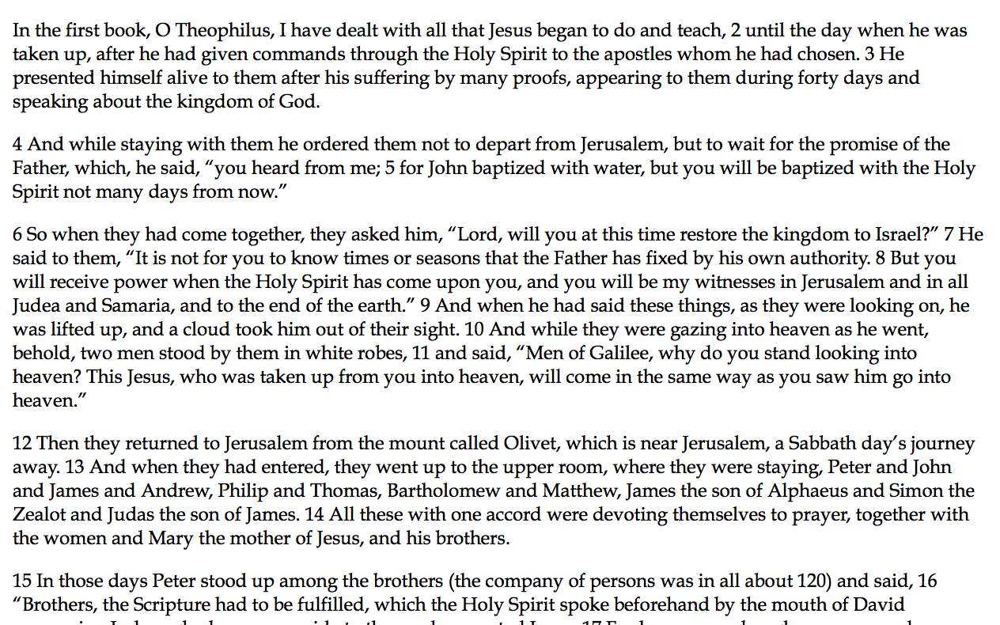
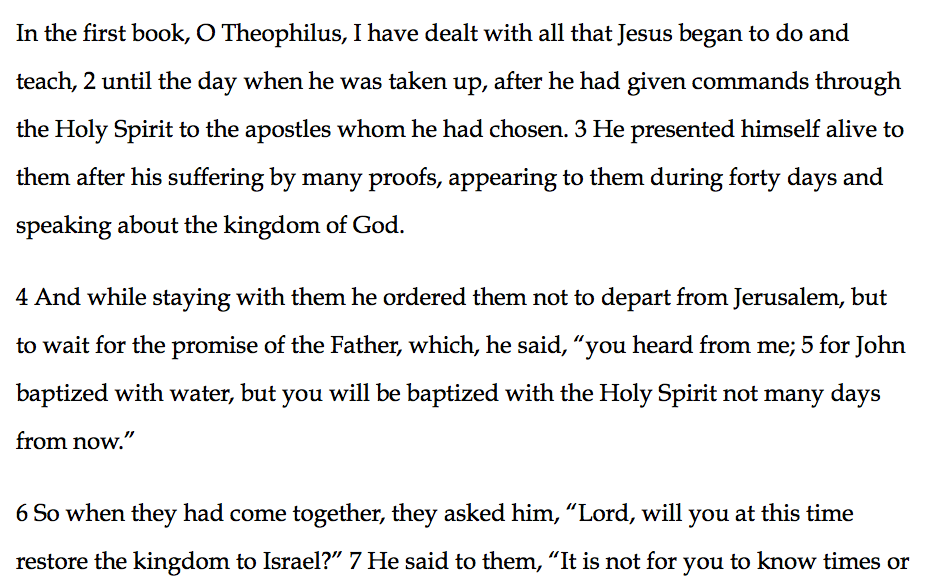

# Tolle Lege!
## Designing Readable Bibles  with Digital Typography

Note:
**[10:30]** 

I'm Chris; I'm a typesetter not typographer and really a developer first of all.
HolyBible.com, SEBTS, family.

------

## “Take Up And Read”

<!-- .element: class="fragment" data-fragment-index="1" -->

<!-- .element: class="fragment" data-fragment-index="1" -->
***Readability matters.***

Note:
**[10:31]**

  - Young man wrestling with faith, believing mother, discussions with his
    pastor, but climactic moment was a children's song, take up and read.

------

## Typography and typesetting

How we *display* a text matters for reading.

  - <!-- .element: class="fragment" data-fragment-index="1" -->
    This includes fonts, but…
  - <!-- .element: class="fragment" data-fragment-index="2" -->
    It also includes a lot of other things, too.

Note:
**[10:34]**

------

### Essential questions

 1. <!-- .element: class="fragment" data-fragment-index="1" -->
    Can you *read* individual words clearly?
 2. <!-- .element: class="fragment" data-fragment-index="2" -->
    Can your eye *flow* through the line easily?
 3. <!-- .element: class="fragment" data-fragment-index="3" -->
    Can your eye *flow* from line to line easily?
 4. <!-- .element: class="fragment" data-fragment-index="4" -->
    Does the *form match the content*?

Note:
**[10:35]**

------

### Tools

  - <!-- .element: class="fragment" data-fragment-index="1" -->
    “Page” layout (flow)
  - <!-- .element: class="fragment" data-fragment-index="2" -->
    Hierarchy and rhythm (flow)
  - <!-- .element: class="fragment" data-fragment-index="3" -->
    Typeface (read words, form matching content)

Note:
**[10:36]**

------

## Layout

Pure bang for your buck:

  - <!-- .element: class="fragment" data-fragment-index="1" -->
    Text size
  - <!-- .element: class="fragment" data-fragment-index="1" -->
    Line length
  - <!-- .element: class="fragment" data-fragment-index="1" -->
    Line height
  - <!-- .element: class="fragment" data-fragment-index="2" -->
    *The relationship between these factors*

Note:
**[10:38]**

------

### Text size

<!-- .element: class="fragment" data-fragment-index="1" -->
Large enough to read.

<!-- .element: class="fragment" data-fragment-index="2" -->
Small enough to read a *lot* (relatively speaking).

<!-- .element: class="fragment" data-fragment-index="3" -->
Not *too* small!

<!-- .element: class="fragment" data-fragment-index="4" -->
–§–

<!-- .element: class="fragment" data-fragment-index="4" -->
There is no hard and fast rule.

<!-- .element: class="fragment" data-fragment-index="4" -->
Typeface matters.

Note:
**[10:39]**

------

### Line length

Rules of thumb:

  - <!-- .element: class="fragment" data-fragment-index="1" -->
    48–78 characters per line
  - <!-- .element: class="fragment" data-fragment-index="2" -->
    10–12 words per line

<!-- .element: class="fragment" data-fragment-index="3" -->
–§–

<!-- .element: class="fragment" data-fragment-index="3" -->
There is no hard and fast rule.

<!-- .element: class="fragment" data-fragment-index="3" -->
Typeface matters.

Note:
**[10:40]**
  
  - also 50–72.
  - Typeface characteristics like character width, the balance between different
    characters, etc. all come into play (more on that below).

------

#### Line length: ~66

------

#### Line length: ~100

------

### Line height

  - <!-- .element: class="fragment" data-fragment-index="1" -->
    “Leading”
  - <!-- .element: class="fragment" data-fragment-index="2" -->
    Rule of thumb: 1.5
  - <!-- .element: class="fragment" data-fragment-index="3" -->
    Adjust up for wider lines
  - <!-- .element: class="fragment" data-fragment-index="4" -->
    Adjust down for narrower lines

<!-- .element: class="fragment" data-fragment-index="5" -->
–§–

<!-- .element: class="fragment" data-fragment-index="5" -->
There is no hard and fast rule.

<!-- .element: class="fragment" data-fragment-index="5" -->
Typeface matters.

Note:
**[10:43]**

------

#### Line height: 1.5

------

------

------

------

#### Line height: 1.2

------

------

------

------

#### Line height: 1.8

------

------

------

------

### Relationship

Typeface, line length, and line height inevitably interact.

<!-- .element: class="fragment" data-fragment-index="1" -->
–§–

<!-- .element: class="fragment" data-fragment-index="1" -->
Different typefaces require different relationships.

  - <!-- .element: class="fragment" data-fragment-index="2" -->
    Didot
  - <!-- .element: class="fragment" data-fragment-index="2" -->
    Century Gothic

Note:
**[10:45]** 

What works with one typeface will not necessarily work with another. Wider fonts
will need more horizontal space: taller ones more vertical room to breathe.

------

## Hierarchy and Rhythm

<!-- .element: class="fragment" data-fragment-index="1" -->
*What's what?*

  - <!-- .element: class="fragment" data-fragment-index="2" -->
    What is a heading?
  - <!-- .element: class="fragment" data-fragment-index="2" -->
    What is body text? 
  - <!-- .element: class="fragment" data-fragment-index="2" -->
    What is something else entirely (e.g. chapter and verse numbers)?
  - <!-- .element: class="fragment" data-fragment-index="2" -->
    How do all the pieces relate to each other?

<!-- .element: class="fragment" data-fragment-index="3" -->
**Difference draws attention.**

Note:
**[10:47]** 

What happens when you get this wrong? People can't follow, and different pieces
blur together. Give example of Webster's Hebrew textbook. Give example of how
you could unintentionally emphasize study notes over the text itself.

------

### Tools

  - <!-- .element: class="fragment" data-fragment-index="1" -->
    Weight, style, ornamentation
  - <!-- .element: class="fragment" data-fragment-index="2" -->
    Typeface
  - <!-- .element: class="fragment" data-fragment-index="3" -->
    White space and position
  - <!-- .element: class="fragment" data-fragment-index="4" -->
    Color

Note:
**[10:49]**

------

#### Weight, style, ornamentation

  - <!-- .element: class="fragment" data-fragment-index="1" -->
    **Bold**
  - <!-- .element: class="fragment" data-fragment-index="2" -->
    *Italic*
  - <!-- .element: class="fragment" data-fragment-index="3" -->
    Ornamentation
      * Underline
      * Markers: † ‡ ¶ § etc.

Note:
**[10:50]**

------

#### Typeface

  - <!-- .element: class="fragment" data-fragment-index="1" -->
    Changing font *inevitably* draws attention.
  - <!-- .element: class="fragment" data-fragment-index="2" -->
    Good ways to use this:
      * Distinguish headers from body text
      * Distinguish notes from Scripture

Note:
**[10:51]** Give example from HolyBible.com with Proxima Nova and Calluna.

------

#### White space

<!-- .element: class="fragment" data-fragment-index="1" -->
The vertical or horizontal space between elements can indicate **relationships**.

<!-- .element: class="fragment" data-fragment-index="2" -->
*(Use a scale!)*

Note:
**[10:53]** 

Adding space between element separates them. Centering, or pulling an item out
to the side, or indenting it, also emphasize it.

------

#### “Don't Compose Without a Scale”

<!-- .element: class="fragment" data-fragment-index="1" -->
Create a “scale” of proportional sizes to use for type size and vertical rhythm.

  - <!-- .element: class="fragment" data-fragment-index="2" -->
    1.618 (golden ratio)
  - <!-- .element: class="fragment" data-fragment-index="3" -->
    modularscale.com

Note:
**[10:54]** Describe the basic approach. Don't wax long.

------

#### Color

  - <!-- .element: class="fragment" data-fragment-index="1" -->
    ***Make it work in grayscale!***
  - <!-- .element: class="fragment" data-fragment-index="2" -->
    Use color to emphasize existing hierarchy

Note:
**[10:56]**

Accessibility follows good design. If the hierarchy works well in gray scale, it
will work well in color. Color is a form of enhancement; it cannot be the only
distinguishing feature in your visual hierarchy.

------

## Typeface

<!-- .element: class="fragment" data-fragment-index="1" -->
Typeface, or ”font,” is the most obvious aspect of typesetting.

Note:
**[10:57]** 

A good choice can make your app, site, etc. stand out above the crowd. A bad one
will make people walk away. A mediocre one will leave the experience up
satisfying—even if people don't know why.

------

## Typeface (cont'd.)

Our goals in choosing a typeface:

  - <!-- .element: class="fragment" data-fragment-index="1" -->
    *Readability in context*
  - <!-- .element: class="fragment" data-fragment-index="2" -->
    *Suitability to text*

Note:
**[10:58]** 

------

### Readability in Context

  - Newspaper
  - Smart phone
  - Book
  - Reference book
  - Laptop

Note:
**[10:59]** 

This is why you see Georgia everywhere online but it looks weird in a printed
Greek textbook. And much the same for Times New Roman (newspaper then digitized
then used in the aforementioned Hebrew book... not good).

------

### Suitability to Text

  - Résumé
  - Bible
  - Soap advertisement
  - Code

Note:
**[11:00]** 

------

### Types of faces

  - Sans vs. serif
  - Proportional vs. monospace
  - Body, display, decorative
  - Stroke: x-height, width, style

Note:
**[11:01]**

  - Examples:
      + Arial and Times New Roman (but please don't use those!)
      + Arial and Courier (repeat!)
      + Body/display: usually different *styles* within a typeface (e.g.
        Condensed, etc.)
  - A “font” is technically a specific size and weight of a typeface. Colloquial
    usage is fine, though!
  - The fonts that ship with any given OS may or may not be good choices.

------

#### Bible Typefaces

  - <!-- .element: class="fragment" data-fragment-index="1" -->
    Choose *readable* over *stylish*
  - <!-- .element: class="fragment" data-fragment-index="2" -->
    Match the typeface to the content
      * <!-- .element: class="fragment" data-fragment-index="3" -->
        Context includes *translation*

Note:
**[11:02]** 

E.g. Avenir Next looks strange with the KJV, but perfectly reasonable with
the NIV or NLT. Hoefler Text is pretty but doesn't work well for long reading.

------

## Tolle Lege!

Focus on readability!

------

## Tolle Lege!

**Layout**: relationship between typeface, line length, and line height.

<!-- .element: class="fragment" data-fragment-index="1" -->
***Get in the flow.***

------

## Tolle Lege!

**Hierarchy and rhythm**: weight, style, ornamentation, and white space.
    
<!-- .element: class="fragment" data-fragment-index="1" -->
***Difference draws attention.***

------

## Tolle Lege!

**Typefaces**: know what distinguishes them. Choose typefaces that are:

  - <!-- .element: class="fragment" data-fragment-index="1" -->
    ***readable in context***
  - <!-- .element: class="fragment" data-fragment-index="2" -->
    ***suitable to the text***

Note:
**[11:05]**

------

### Resources
  - AListApart.com
  - ILoveTypography.com
  - modularscale.com

------

### Contact
  - Home page: [chriskrycho.com]
  - Email: [chris@krycho.com]
  - Podcast: [www.winningslowly.org]
  - Social media:
      * Twitter: [\@chriskrycho][tw]
      * App.net: [\@chriskrycho][adn]
      * LinkedIn: [chriskrycho][li]
      * Facebook: [chriskrycho][fb]
      * Instagram: [chriskrycho][insta]

[chriskrycho.com]: http://v4.chriskrycho.com
[chris@krycho.com]: mailto:chris@krycho.com
[www.winningslowly.org]: http://www.winningslowly.org
[tw]: https://www.twitter.com/chriskrycho
[adn]: https://alpha.app.net/chriskrycho
[li]: https://www.linkedin.com/in/chriskrycho
[fb]: https://www.facebook.com/chriskrycho
[insta]: https://www.instagram.com/chriskrycho

Note:
**[11:06]**

